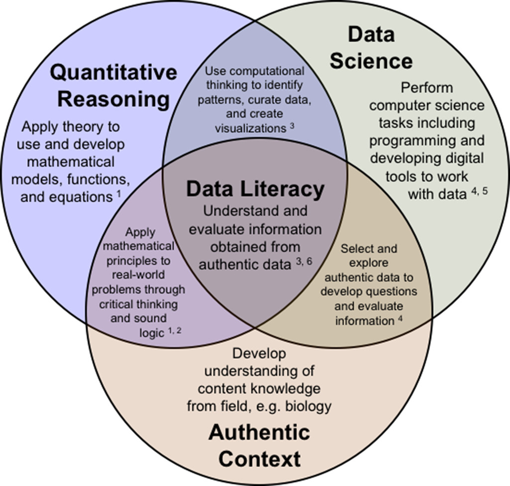
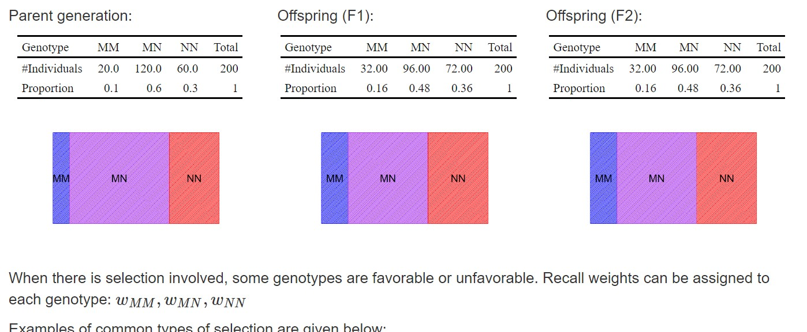
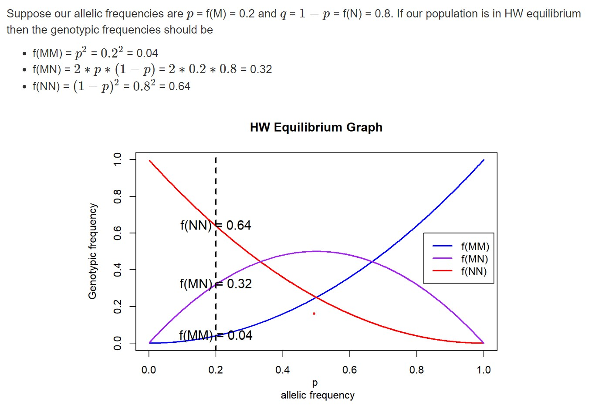
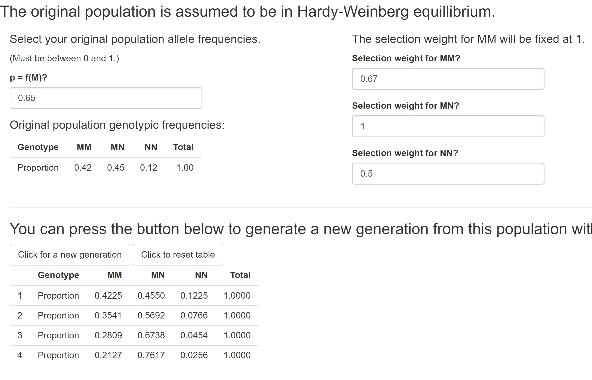
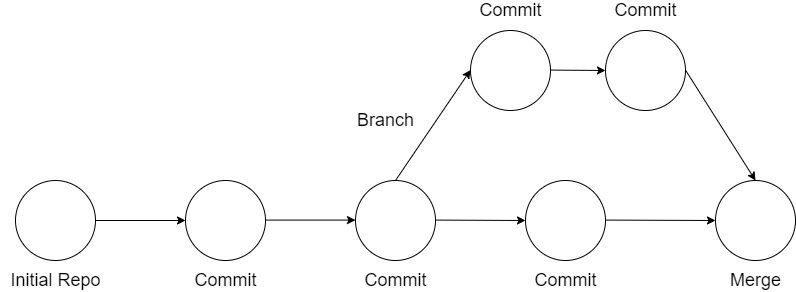
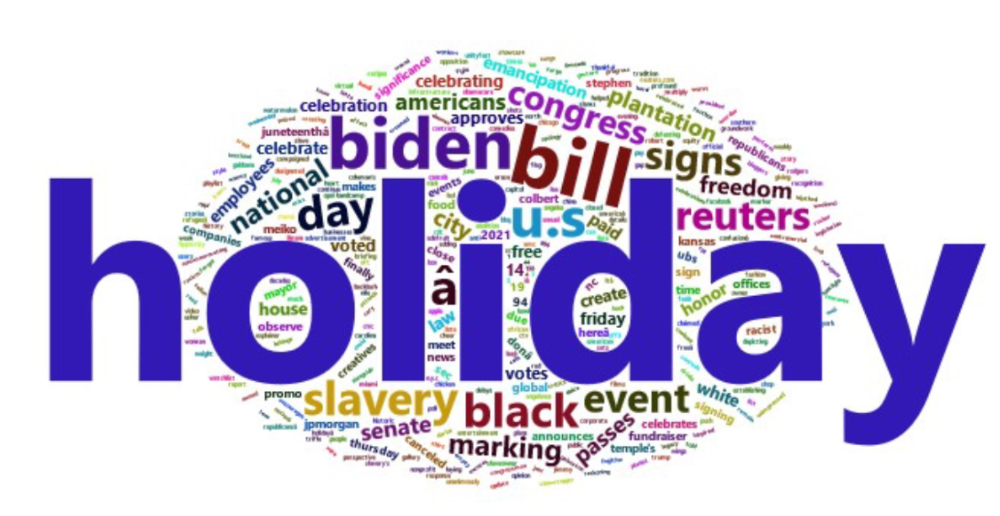

## Quantitative Literacy (QL)

  

 

My first year of teaching full time was at a liberal arts university (University of Mount Union). The focus on a well-rounded education was great and really benefited the students in unexpected ways. When I came to NC State I started down the road of advocating for quantitative literacy in joint work with communications professor Andrew Binder.  We received an 'Interdisciplinary Liaisons' grant. For the project he came to my course to teach a few lectures about communicating statistical results to different audiences and I went to his course to discuss the concepts behind the statistical analyses his students were seeing and why they were important. While a short lived project, it helped lead me to a more formal role I held with the Division of Academic and Student Affairs (DASA). 

### Quantitative Literacy Champion with DASA

From 2018-2020 I served as a *Quantitative Literacy Champion* for DASA. Aside from being the coolest title I've ever had, it was a great opportunity to discuss QL topics with a diverse group of faculty. We presented results from different QL assessments done on campus and eventually moved toward a model of supporting improving QL outcomes across campus.  

We discussed the work at the UNC System Student Success Conference and you can find the <a href = "../files/Championing_General_Education_ UNC_Presentation.pptx" target = "_blank">slides for the presentation here</a>. A few articles of note from this role:

+ <a href = "https://provost.ncsu.edu/news/2019/12/pack-hacks-for-faculty-quantitative-literacy-on-discussion-boards/" target = "_blank">Talking Quantitative Data Through Discussion Boards</a> 
+ <a href = "https://docs.google.com/presentation/d/1Ut8N-cxrIp2KaHCn7I-vZEuTW3yIHhfu9ApaXVKflt0/edit?usp=sharing" target = "_blank">Creating a hands-on data exploration activity for your students - no programming required! </a>

The most significant project I worked on is outlined below.

### STEM Education Initiative

  

 

Quantitative literacy (QL) is one of our general education competencies at NC State. QL requires contextualized reasoning with quantities and refers to the ability to interpret data and to reason with numbers within real-world problems (<a href = "https://www.maa.org/sites/default/files/pdf/QL/MathAndDemocracy.pdf" target = "_blank">National Council on Education and the Disciplines</a>. This implies that QL should be supported throughout each degree program’s curriculum. This can be difficult as experts in one field (such as biology) may not be experts in QL aspects. <a href = "https://www.linkedin.com/in/whitney-jones-72a63571/" target = "_blank">Whitney Jones</a> (Biological Sciences) and I decided to collaborate - with logistical support from Department of Academic and Student Affairs (DASA) and funding support from Bob Beichner's STEM Education Initiative grant, in an attempt to improve quantitative literacy outcomes in the course GN 311 - Principles of Genetics. Specifically we developed data investigations, created data visualization activities, and considered alternative presentations of quantitative ideas for a portion of the course.

  

 

GN 311 covers basic concepts and principles of prokaryotic and eukaryotic genetics.  Mendelian inheritance, polygenic inheritance, linkage and mapping, chromosome aberrations, population genetics, evolution, DNA structure and replication, gene expression, mutation, gene regulation, extranuclear inheritance, bacterial and viral genetics, and recombinant DNA technology. In talks with the instructor of the course, Whitney Jones, we identified understanding basic population genetics as an area of concern. Specifically the students struggled to conceptualize the idea of there being certain frequencies of phenotypes and genotypes in a population and how those
frequencies behave over time. We developed interactive data visualizations to allow students to see how frequencies change over time with the hope of improve learning
outcomes associated with QL.

We focused on two major interventions. 
- A lab exercise to 
    + <a href = "https://www4.stat.ncsu.edu/~jbpost2/GN311/HW.html" target = "_blank">reinforce the ideas of Hardy-Weinberg (HW) Equilibrium using visuals</a>
    + describe the major ideas of the chi-square test used to check the assumption of HW equilibrium
- A lab exercise to
    + <a href = "https://www4.stat.ncsu.edu/~jbpost2/GN311/Selection.html" target = "_blank">investigate the idea of selection using visuals</a>
    + allow for <a href = "https://shiny.stat.ncsu.edu/jbpost2/Selection/" target = "_blank">interactive simulation of new generations based upon user selected weights and probabilities of different alleles</a>

  

 

While the pandemic threw a huge wrench in our plans, we did analyze the data collected and <a href = "../files/UsingVisualsQL.pdf" target = "_blank">presented a poster at the NC State Teaching and Learning Symposium</a>. A more detailed (and slightly less organized) <a href = "../files/GN311_results.html" target = "_blank">analysis of the data collected can be found here</a>. These analyses were conducted by David Stokes and myself. We did see some improvements in the spring cohort over the fall cohort. In particular, the previous math level of students was significant in some models with coefficients implying that perhaps our intervention helped those with more mathematical background learn more effectively. This implies there may be a need for some supplemental math discussions for those with a weaker math background.

## DELTA Faculty Fellows Related Work

From 2018 to 2020 I served as a <a href = "https://delta.ncsu.edu/about-delta/meet-our-faculty-fellows/" target = "_blank">DELTA Faculty Fellow</a>.  DELTA (Digital Education and Learning Technology Applications) is the group on campus that handles and trains people on most all of our <a href = "https://ncsu.service-now.com/delta?id=delta_home" target = "_blank">digital education components (Moodle, Zoom, Panopto, etc.)</a>.  DELTA is really the group that sets our university up for success in the online space.  I can't say enough great things about the people over there! 

A few articles and presentations associated with this role:

+ <a href = "https://delta.ncsu.edu/news/2022/05/19/early-adopters-of-moodle-4-share-experiences/" target = "_blank">Early Adopters of Moodle 4 Share Experiences</a>
+ <a href = "https://docs.google.com/presentation/d/1g0sbNq23ZKsou9RgZwr4k6n8ctaSB-RlKk3NQF8djgg/edit?usp=sharing" target = "_blank">Flip Forward into the Pool of Student Engagement</a> (with Christopher Beeson)
+ <a href = "https://docs.google.com/presentation/d/1OJex4_DBTnxX2Q6aWk8VtLuYbzIOjqG2/edit?usp=sharing&ouid=110361049382817738792&rtpof=true&sd=true" target = "_blank">Blended Learning</a> (with Bethany Smith)

## Online Program Random Topics

In an effort to help the online program students develop some of those 'other' skills that are great to have but aren't necessarily taught in classes, we held a sequence of meetings about *random fun* topics.  These topics included:

  

 

- Git and github
- Using the command line
- Makefiles
- HTML and CSS basics
- Power BI
- Latex

As time goes on we'll be adding more presentations. You can find <a href = "https://jbpost2.github.io/OnlineProgramFunTimes/" target = '_blank'>information about the presentations here</a>. 

## Fun Word Cloud Activity 

  

 

At the 2021 USCOTs meetings I gave a short presentation about a fun activity for courses that use R. The session gave an example of connecting to an Application Program Interface (API) to obtain data and create a basic world cloud. APIs are often seen as a scary topic that seems overwhelming. Really an API is just a communication protocol for common tasks such as downloading data or creating predictions from a model. Code was given on how to use R packages to obtain data from an open API and easily tokenize the data in order to create fun word clouds! The topics covered in the session lent themselves to downloading data from other sources as well.

<iframe width="560" height="315" src="https://www.youtube.com/embed/SUmrPnJCJy0" title="YouTube video player" frameborder="0" allow="accelerometer; autoplay; clipboard-write; encrypted-media; gyroscope; picture-in-picture; web-share" allowfullscreen></iframe>

The code for downloading the data and creating the visual is <a href = 'https://github.com/jbpost2/APIWordCloudR' target = "_blank">available in the `APIWordCloud.Rmd` file on the github repo here</a>.

