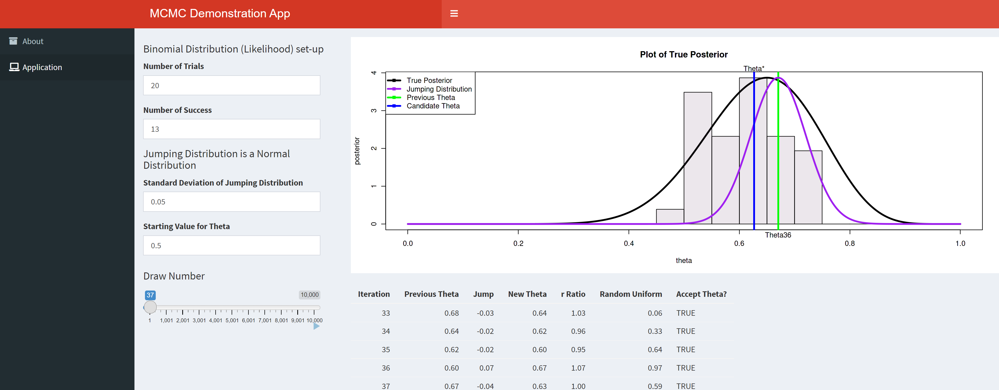
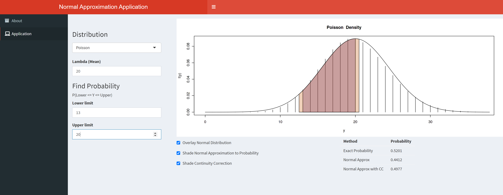

## R Shiny Apps

Creating visuals to explain concepts or to show nuances can make a huge impact on student learning.  Having visuals that can be modified by a user allows students to ask their own questions, explore, and deepen their understanding.  

  

R Shiny is a package in R that allows for the creation of dynamic visuals that can run R code on the back end.  I use these types of apps in my teaching quite often.  Below are some of the apps I use in my classes.  All of the code for these apps is available in github repos.  

 

### <a href="https://shiny.stat.ncsu.edu/jbpost2/BasicBayes/" target = "_blank">Basic Bayes App</a> 

This is a basic prior/posterior visualization app.  You can see how the posterior changes under different likelihoods and prior distribution settings.  Specifically, the Beta distribution as the conjugate prior for the Binomial and the Gamma distribution as the conjugate prior for the Poisson are implemented.

 

### <a href="https://shiny.stat.ncsu.edu/jbpost2/MCMC/" target = "_blank">MCMC App</a>

Metropolis Hastings visualization for an example where we know the posterior distribution.  Specifically, this app demonstrates a basic implemention of the MH algorithm for the use of a Beta prior on a Binomial likelihood.

 

### <a href="https://shiny.stat.ncsu.edu/jbpost2/NormalApproximation/" target = "_blank">Normal Approx App</a>

The commonly used Normal approximations to the Binomial distribution and to the Poisson distribution are visualized in this app.  Continuity corrections are shown visually and compared to the exac and non-corrected probabilities.

 

### <a href="https://shiny.stat.ncsu.edu/jbpost2/SamplingDistribution/" target = "_blank">Sampling Dist App</a>

This applet visualizes the sampling distribution of different statistics.  The parent population can easily be changed to many of the commonly named distributions.  Great for debunking the $n>30$ myth.

 

### <a href="https://shiny.stat.ncsu.edu/jbpost2/OrderStatsDist/" target = "_blank">Order Statistics App</a>

This applet simulates the distribution of an order statistic from a random sample of beta random variables.  One of the biggest issues in teaching this material is to get the students to understand that there is a distribution for, say, the smallest value from the sample!  The theory is given in the app along with a visualization of the joint distribution of two order statistics.

 

### <a href="https://shiny.stat.ncsu.edu/jbpost2/NormalPower/" target = "_blank">Normal Power App</a>

A power applet to demonstrate the ideas surrounding power for a one sample mean test from a normal population with known variance.

 

### <a href="https://shiny.stat.ncsu.edu/jbpost2/ZScores/" target = "_blank">Z Score App</a>

A basic applet to visualize probabilities for a Normally distributed random variable and the corresponding calculation for a Standard Normal random variable.

 

### <a href="https://shiny.stat.ncsu.edu/jbpost2/Delta/" target = "_blank">Delta Method App</a>

An applet to visualize and compare the first and second order delta method approximations.  Exact values for the transformation's mean can be compared to the approximated values.

 

### <a href="https://shiny.stat.ncsu.edu/jbpost2/Transform/" target = "_blank">Transformation App</a>

An applet to visualize the transformation from a Gamma to an Inverse Gamma Random Variable.  The app attempts to show how the CDFs of the original random variable and the transformed random variable behave.  

 

## Other Useful <strong>Vis and App Sites</strong>

<ul>
  <li> <a href="https://www.rossmanchance.com/applets/index2021.html" target = "_blank">Rossman Chance Apps</a> </li>
</ul>

  <blockquote cite="https://www.rossmanchance.com/applets/index2021.html">
    Rossman/Chance Applet Collection 2021
  </blockquote> 

<ul>
  <li>  <a href="http://www.lock5stat.com/statkey/index.html" target = "_blank">Stat Key</a></li>
</ul>

  <blockquote cite="http://www.lock5stat.com/statkey/index.html">
    StatKey to accompany Statistics: Unlocking the Power of Data
  </blockquote> 

### <a href = "https://sites.psu.edu/shinyapps/" target = "_blank">Penn State - Book of Apps for Statistics Teaching</a>

  <blockquote cite="https://sites.psu.edu/shinyapps/">
    The book is laid out in twelve chapters with four at the introductory level covering topics in Data Gathering, Data Description, Basic Probability, and Statistical Inference and with eight chapters at the upper division level covering Probability, Regression, ANOVA, Time Series, Sampling, Categorical Data, Data Science, Stochastic Processes, and Biology.
  </blockquote> 

### <a href = "https://github.com/gastonstat/shiny-introstats/" target = "_blank">Gaston Sanchez - Apps for Feedman, Pisani, and Purves (2007)</a>

  <blockquote cite="https://github.com/gastonstat/shiny-introstats/">
    This is a collection of Shiny apps for introductory statistics courses based on the classic textbook Statistics by David Freedman, Robert Pisani, and Roger Purves (2007). Fourth Edition. Norton & Company.
  </blockquote> 

### <a href = "http://www.statistics.calpoly.edu/shiny" target = "_blank">Cal Poly apps</a>

  <blockquote cite="http://www.statistics.calpoly.edu/shiny">
    Web Application Teaching Tools for Statistics Using R and Shiny.
  </blockquote> 

### <a href = "http://www2.stat.duke.edu/~mc301/shinyed/" target = "_blank">Apps by Brittany Cohen</a>

  <blockquote cite="http://www2.stat.duke.edu/~mc301/shinyed/">
    Statistics education apps created with Shiny. 
  </blockquote> 

### <a href="http://web.grinnell.edu/individuals/kuipers/stat2labs/Labs.html" target = "_blank">Stat 2 Labs</a>

  <blockquote cite="http://web.grinnell.edu/individuals/kuipers/stat2labs/Labs.html">
    This stat2labs site provides project-based materials that emphasize real-world applications and conceptual understanding. The materials are designed to ease the workload of faculty while still incorporating research-like experiences into their own classes.
  </blockquote> 

### <a href="http://www.distributome.org/" target = "_blank">Distributome.org</a>

  <blockquote cite="http://www.distributome.org/">
    The Probability Distributome Project is an open-source, open content-development project for exploring, discovering, navigating, learning, and computational utilization of diverse probability distributions.
  </blockquote> 

