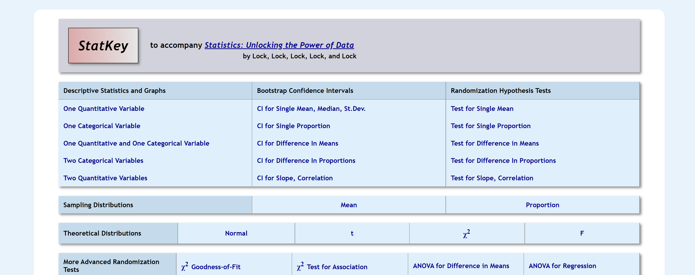

## R Shiny Apps  

### <a href="https://shiny.stat.ncsu.edu/jbpost2/BasicBayes/">Basic Bayes App</a> 

Prior/posterior example. Corresponds to Mathematical Statistics and Data Analysis section 3.5, example E, by John Rice.
Flipping a coin 30 times and observing # of Heads. Likelihood is a binomial. You can alter the Beta prior on Theta = P(Heads).

### <a href="https://shiny.stat.ncsu.edu/jbpost2/MCMC/">MCMC App</a>

Metropolis Hastings visualization for the same example as the Basic Bayes App.

### <a href="https://shiny.stat.ncsu.edu/jbpost2/NormalApproximation/">Normal Approx App</a>

Normal Approximation to the Binomial distribution and to the Poisson distribution.

    

        

            
            <h3> 
<a href="https://shiny.stat.ncsu.edu/jbpost2/SamplingDistribution/">Sampling Dist App</a>
            </h3>
            
 
Applet to visualize sampling distributions of different statistics from differing parent populations.
            

        

        

            
            <h3>
<a href="https://shiny.stat.ncsu.edu/jbpost2/OrderStatsDist/">Order Statistics App</a>
            </h3>
        	

Applet that simulates the distribution of an order statistic from a beta distribution random sample. The joint distribution is also visualized as well.

        

        

            
            <h3>
<a href="https://shiny.stat.ncsu.edu/jbpost2/NormalPower/">Normal Power App</a>
            </h3>

Power applet to demonstrate ideas for a one sample mean test from a normal population with known variance.

        

        

    

    

        

            
            <h3> 
<a href="https://shiny.stat.ncsu.edu/jbpost2/ZScores/">Z Score App</a>
            </h3>
            
 
		Applet to visualize the standardization of normal random variables.
            

        

        

            
            <h3> 
		<a href="https://shiny.stat.ncsu.edu/jbpost2/Delta/">Delta Method App</a>
            </h3>
            
 
		Applet to visualize and compare the first and second order delta method.
            

        

        

            
            <h3> 
		<a href="https://shiny.stat.ncsu.edu/jbpost2/Transform/">Transformation App</a>
            </h3>
            
 
		Applet to visualize the transformation from a Gamma to an Inverse Gamma Random Variable.
            

        

        

    

    

        

            

            <h2 class="intro-text text-center"> Other Useful <strong>Vis and App Sites</strong>
            </h2>
            

        

        

            
            <h3> 
<a href="http://www.rossmanchance.com/applets/">Rossman Chance Apps</a> 
            </h3>
           
 
Applets to teach intro stats using the randomization based approach.
            

        

        

            
            <h3>
<a href="http://www.lock5stat.com/statkey/index.html">Stat Key</a>
            </h3>
        	

 Applets to accompany the book <i>Statistics Unlocking the Power of Data</i>, another randomization based approach to intro stats.

        

        

            
            <h3>
<a href="http://web.grinnell.edu/individuals/kuipers/stat2labs/Labs.html">Stat 2 Labs</a>
            </h3>

Game based resources for teaching intro stats.

        

        

            
            <h3>
<a href="http://www.distributome.org/">Distributome.org</a>
            </h3>

The Probability Distributome Project is an open-source, open content-development project for exploring, discovering, navigating, learning, and computational utilization of diverse probability distributions.

        

        

    

