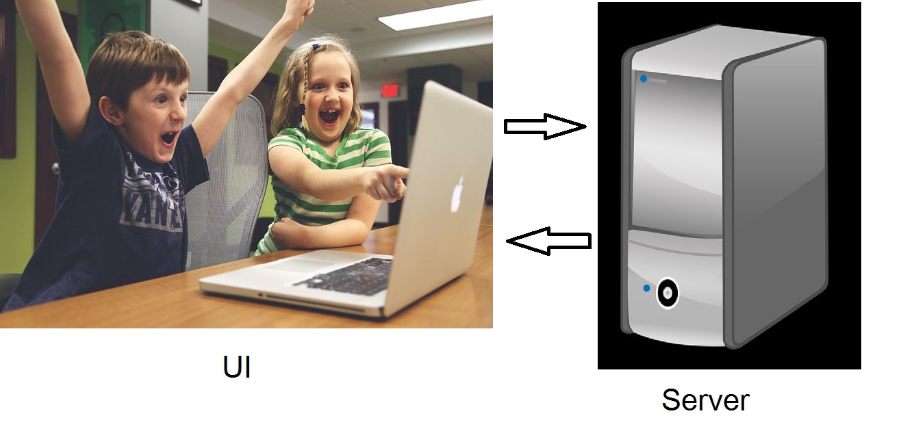
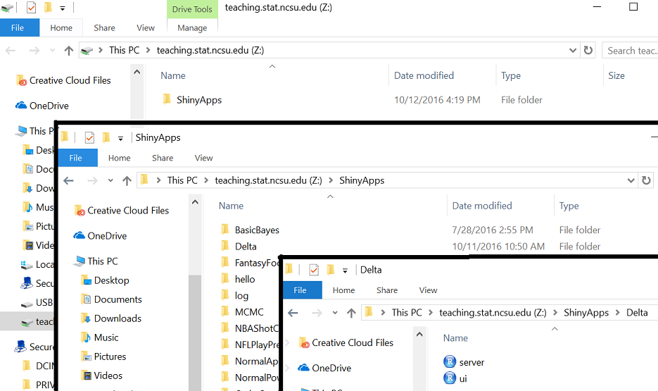
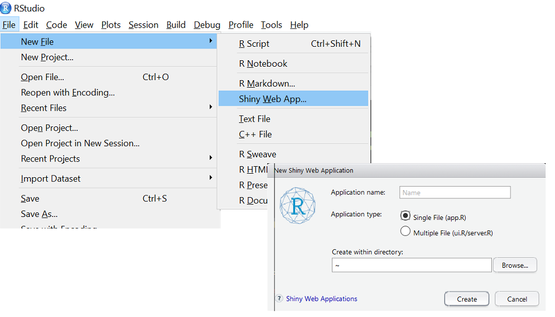

```{r setup,echo=FALSE,message=FALSE}
library(dplyr)
options(dplyr.print_min = 5)
library(knitr)
library(readr)
opts_chunk$set(echo = FALSE)
```

## What is R Shiny?  

 - [Baseball App](http://shiny.stat.ncsu.edu/jbpost2/BaseballHitting/) 

  - [R Shiny Package](http://shiny.rstudio.com/) allows for creation of interactive "web" applications in R  

  - Developed by RStudio  
  
  - Basically a folder with 2 R scripts: 
      + $\texttt{ui.R}$ (User Interface)
      + $\texttt{server.R}$ (R functions that run/respond to UI)
  - Requires no HTML, CSS, or JavaScript!
  
    
## Example App
```{r eruptions}
inputPanel(
  selectInput("n_breaks", label = "Number of bins:",
              choices = c(10, 20, 35, 50), selected = 20),
  
  sliderInput("bw_adjust", label = "Bandwidth adjustment:",
              min = 0.2, max = 2, value = 1, step = 0.2)
)

renderPlot({
  hist(faithful$eruptions, probability = TRUE, breaks = as.numeric(input$n_breaks),
       xlab = "Duration (minutes)", main = "Geyser eruption duration")
  
  dens <- density(faithful$eruptions, adjust = input$bw_adjust)
  lines(dens, col = "blue")
})
```

        
## Why use R Shiny?  

  - If you know R, not too bad to learn  
  
  - Can be great way to    
    
    + Share data analysis results  

    + Allow user to explore data  
    
    + Explain statistical concepts/teach  


## How to Develop R Shiny Apps

  - Explore online repositories/resources for existing apps!  
  
>  - Write 'static' R code  
  
>  - Sketch layout for interface  
  
>  - Translate to Shiny  
  
>  - Deploy app  
  

##Available Apps  

  - [Some of My Apps](http://www4.stat.ncsu.edu/~post/teaching.html)
  
  - Plenty of good examples  
     + [Shiny Showcase](https://www.rstudio.com/products/shiny/shiny-user-showcase/)  
     + [Shiny Gallery](https://shiny.rstudio.com/gallery/)  
     + [Stat Concepts](https://github.com/gastonstat/shiny-introstats/)  
     + [More Stat Concepts](https://www.researchgate.net/publication/298786680_Web_Application_Teaching_Tools_for_Statistics_Using_R_and_Shiny)  
     + [Cal Poly](http://www.statistics.calpoly.edu/shiny)
  

##Getting Started - Basic Needs  
  *  R, R studio   
  
  *  `shiny` package   
  
  *  Recommended other packages   
  
      + `shinydashboard`      

      +  `DT` (Nice Tables)        


##Elements of an App
  - Each app has two things
    * User Interface (UI) 
    * Server     


##App Duties  
```{r appRep.png, out.width = "750px"}

``` 

##Elements of an App
  - Each app has two things  
    * User Interface (UI)  
    * Server     

  - UI determines **layout** of app  
      + Sets up widgets (items users can interact with)  


##Elements of an App
  - Each app has two things  
    * User Interface (UI)  
    * Server     
    
  - UI determines **layout** of app  
      + Sets up widgets (items users can interact with)  
  
  - Server contains R code to **run the app**  
      + Can include plots, model fitting, etc.  


##Elements of an App
  - Each app has two things
    * User Interface (UI) 
    * Server     
    
  - UI determines **layout** of app  
      + Sets up widgets (items users can interact with)  
  
  - Server contains R code to **run the app**  
      + Can include plots, model fitting, etc.  
    
  - Most often two files but can be done in one


 

##Two File Approach (Recommended)  

  - Create folder called **ShinyApps**    

  - Within folder, create folder for each App   

  - Each App's folder should have `ui.R` and `server.R` files  
  

***  



##Common Layout
```{r layout,echo=FALSE}
shinyUI(fluidPage(
  titlePanel("title panel"),

  sidebarLayout(
    sidebarPanel( "sidebar panel",br(),"|",
              br(),"|",br(),"|",br(),"|",br(),"|",br(),"|",br(),"V",br(),"Usually User Inputs"),
    mainPanel("main panel content-------------------->",br(),"|",
              br(),"|",br(),"|",br(),"|        Usually Output",br(),"|        that Reacts to User Input",br(),"|",br(),"V")
  )
))
```  


##`ui.R` Basic File
```{r basic-ui,eval=FALSE,echo=TRUE}
library(shiny)

ui <- fluidPage(
  sidebarLayout(
    sidebarPanel(#usually widgets
      ),
    mainPanel(#usually output
      )
  )
)
```

##server.R Basic File  
```{r basic-server,eval=FALSE,echo=TRUE}
library(shiny)

shinyServer(function(input, output) {

})
```  

##Shiny Templates  
Readily available in R studio  
  

##Two File Template
```{r two-file-template-ui,eval=FALSE,echo=TRUE}
library(shiny)
# Define UI for application that draws a histogram
ui <- fluidPage(
   # Application title
   titlePanel("Old Faithful Geyser Data"),
   # Sidebar with a slider input for number of bins 
   sidebarLayout(
      sidebarPanel(
         sliderInput("bins",
                     "Number of bins:",
                     min = 1,
                     max = 50,
                     value = 30)
      ),
      # Show a plot of the generated distribution
      mainPanel(
         plotOutput("distPlot")
      )
   )
)
```

##Two File Template  
```{r two-file-template-server,eval=FALSE,echo=TRUE}
# Define server logic required to draw a histogram
server <- function(input, output) {
   output$distPlot <- renderPlot({
      # generate bins based on input$bins from ui.R
      x    <- faithful[, 2] 
      bins <- seq(min(x), max(x), length.out = input$bins + 1)
      
      # draw the histogram with the specified number of bins
      hist(x, breaks = bins, col = 'darkgray', border = 'white')
   })
}
```  

##Running an App  
  - While `ui.R` or `server.R` is your active window, click the **Run App** button  
   
  

##Running an App  
  - While `ui.R` or `server.R` is your active window, click the **Run App** button  
      
  
  - Set working directory to ShinyApps folder  
  - Load `shiny` package  
  - Use `runApp()` function  
     * ex: `runApp("normalPower")`   


##Running an App  
  - While `ui.R` or `server.R` is your active window, click the **Run App** button  
      
  
  - Set working directory to ShinyApps folder  
  - Load `shiny` package  
  - Use `runApp()` function  
     * ex: `runApp("normalPower")`   

  - Running App will tie up R console!  
  - End by hitting Esc or closing shiny app


##Adding to the UI - Widgets  
  - Widgets can be added using their `*Input` functions  
  - Separate widgets (and other items) by commas in ui.R file


##Adding to the UI - Widgets  
  - Widgets can be added using their `*Input` functions  
  - Separate widgets (and other items) by commas in ui.R file
    
  
  
##Adding to the UI - Other Items  
Using a comma to separate items, you can add  

- Any plain strings  
- Formatted text (using HTML type functions)  
    
- Output from things created in the `server.R` file  
  
  
    
##Sharing Between Server and UI  
  


##Adding to the UI - Example Syntax
```{r ui-syntax,echo=TRUE,eval=FALSE}
library(shiny)
ui <- fluidPage(
  sidebarLayout(
    sidebarPanel(
      h2("Widgets/Text"),
      numericInput("NI",label="Intercept",value=10),
      sliderInput("SI",label="Slope",min=-1,max=1,value=0,step=0.1),
      "More text",
      br(),
      a(href="http://www.rstudio.com",target="_blank","Link to RStudio")
    ),
    mainPanel(plotOutput("dataPlot"), #dataPlot is name of "plot" object in server
              textOutput("dataInfo"), #dataInfo is name of "text" object in server
              dataTableOutput("dataTable") #dataTable is name of "data" object in server
    )
  )
)
```

***
```{r,eval=TRUE,echo=FALSE,message=FALSE}
library(shiny)
library(DT)
library(ggplot2)
shinyApp(
  ui <- fluidPage(
    sidebarLayout(
      sidebarPanel(
        h2("Widgets/Text"),
        numericInput("NI",label="Intercept",value=10),
        sliderInput("SI",label="Slope",min=-1,max=1,value=0,step=0.1),
        "More text",
        br(),
        a(href="http://www.rstudio.com",target="_blank","Link to RStudio")
      ),
      mainPanel(plotOutput("dataPlot"), #dataPlot is name of "plot" object in server
                h3(textOutput("dataInfo")), #dataInfo is name of "text" object in server
                dataTableOutput("dataTable") #dataTable is name of "data" object in server
      )
    )
  ),
  shinyServer(function(input, output,session) {
    
    dataSet<-reactive({
      #get inputs
      intercept<-input$NI
      slope<-input$SI
      
      x<-rnorm(100)
      y<-intercept+slope*x+rnorm(100)
      
      data.frame(y=y,x=x)
    })
    
    #create plot
    output$dataPlot<-renderPlot({
      data<-dataSet()
      
      fit<-lm(data$y~data$x)
      p<-ggplot(data=data,aes(x=data$x,y=data$y))+geom_point()+geom_smooth(method=lm)
      p
    })
    
    output$dataInfo<-renderText(paste0("The true intercept is ",input$NI,".  The true slope is ",input$SI,"."))
    
    output$dataTable<-renderDataTable(dataSet())
  })
)
```

##Summary So Far   
`ui.r`    

  - Controls layout of app    

  - Basic layout uses a sidebar panel and a main panel    

  - Use strings, formatted (html style) text, widgets (`input*` functions), and output from `server.r`  (`*Output` functions)    

  - Separate items with commas      


##Server file  
`server.r` also called the 'back-end' because it works behind-the-scenes; its actions are not directly visible

```{r server-basics, eval=FALSE,echo=TRUE}
## set up server
shinyServer(function(input, output) {
  # add stuff
})
```


##Server file  
`server.r` also called the 'back-end' because it works behind-the-scenes

```{r server-basics2, eval=FALSE,echo=TRUE}
## set up server
shinyServer(function(input, output) {
  # add stuff
})
```

The arguments for the server are `input` and `output`, which allow us to    

  1. Take in inputs from the UI        
  
  2. Run functions on them     
  
  3. Create outputs to send back     
  

##Creating Output to Send to UI  
  

##Creating Output to Send to UI
Example syntax
```{r server-syntax,echo=TRUE,eval=FALSE}
shinyServer(function(input,output){
  output$nameOfOutputObject<-renderPlot(
    #code that will return a plot
  )
  
  output$otherOutput<-renderText(
    #code that will return something that R can coerce to a string
  )
})

#in ui.r file, reference would look like
plotOutput("nameOfOutputObject")
textOutput("otherOutput")
```

##Accessing Input Values in server.R
 - Every input object has an `inputID`


##Accessing Input Values in server.R
 - Every input object has an `inputID`
 - In `server.r`, reference input value by
```{r input-ref,echo=TRUE,eval=FALSE}
input$inputID
```


##Accessing Input Values in server.R
 - Every input object has an `inputID`
 - In `server.r`, reference input value by
```{r input-ref2,echo=TRUE,eval=FALSE}
input$inputID
```
 - Example
```{r input-ref-ex,echo=TRUE,eval=FALSE}
#input widget code from ui.r file
sliderInput(inputID = "slide",label = "Select the Range Here",min = 0,max = 1,
            value = c(0,1))
#reference in server.r might look like
output$userPlot<-renderPlot({
  range<-input$slide
  #create plot that changes based on user input
  plot(data,xlim=range)  
})
```  

##Input and Output  
 -  `input` and `output` objects are kind of like **lists**  
 
> -  Shiny passes the information back and forth through them  


##Input and Output  
 -  `input` and `output` objects are kind of like **lists**  
 -  Shiny passes the information back and forth through them  
 -  Notice how we name our output objects  
```{r naming,echo=TRUE,eval=FALSE}
output$nameOfOutputObject<-renderPlot(...))  
```    


##Input and Output  
 -  `input` and `output` objects are kind of like **lists**  
 -  Shiny passes the information back and forth through them  
 -  Notice how we name our output objects  
```{r naming2,echo=TRUE,eval=FALSE}
output$nameOfOutputObject<-renderPlot(...))  
```    
 - Notice how we access our inputs
```{r accessing,echo=TRUE,eval=FALSE}
output$nameOfOutputObject<-renderPlot(
   range<-input$slide
))  
```    
> - Important to know what R returns to the server!


***
	```{r widget-app,echo=FALSE,message=FALSE}
library(shiny)
library(rvest)

#function to get help file and format
helpFile<-function(site){
	code<-read_html(site)
	title<-html_node(code,"body") %>% html_node("h1") %>% html_text()
	rcode<-html_node(code,"body") %>% html_node("pre")
	args<-html_node(code,"body") %>% html_node("table")
	as.character(paste(paste0("<h3>",title,"</h3>"),"<h4>Usage</h4>",rcode,"<h4>Arguments</h4>",args,sep=" "))
}

# Define UI for application that draws a histogram
shinyApp(
	# Define UI for application that draws a histogram
	ui <- fluidPage(
		# Application title
		titlePanel(h1("Shiny Widgets for the UI")),
		
		# Sidebar with a slider input for number of bins 
		fluidRow(
			column(6,
						 fluidRow(
						 	column(6,selectizeInput("widget", label = h2("Widget"),
						 													choices = c("Button","Check Box","Check Box Group","Date Input","Date Range","File Input","Numeric Input","Radio Button","Select Box","Slider","Text Input"), selected = "Button")
						 	),
						 	column(6,
						 				 conditionalPanel(condition="input.widget == 'Button'",actionButton("B",h3("Click Here!"))),
						 				 conditionalPanel(condition="input.widget == 'Check Box'",checkboxInput("CB",label=h3("Add Element"),value=FALSE,width='100%')),
						 				 conditionalPanel(condition="input.widget == 'Check Box Group'",checkboxGroupInput("CBG",h3("Select From the Choices Below"),choices=list("Option A","Option B","Option C","Option D"),width='100%')),
						 				 conditionalPanel(condition="input.widget == 'Date Input'",dateInput("DI",h3("Input a Date Here",style="border-style:outset"),value='2016-11-122')),
						 				 conditionalPanel(condition="input.widget == 'Date Range'",dateRangeInput("DR",h3("Input Dates Here",style="border-style:inset"),start='1983-11-14')),
						 				 conditionalPanel(condition="input.widget == 'File Input'",fileInput("FI",h3("Select File to Input"))),
						 				 conditionalPanel(condition="input.widget == 'Numeric Input'",numericInput("NI",h3("Enter a Number Between 0 and 1000"),value=0,min=0,max=1000,step=5)),
						 				 conditionalPanel(condition="input.widget == 'Radio Button'",radioButtons("RB",h3("Select a Choice Below",style="background-color:lightblue;border-style:dotted"),choices=list("Option A","Option B","Option C","Option D"))),
						 				 conditionalPanel(condition="input.widget == 'Select Box'",selectInput("SB",h3("Select From the Group Below"),choices=list("Option A","Option B","Option C","Option D"),multiple=TRUE)),
						 				 conditionalPanel(condition="input.widget == 'Slider'",sliderInput("S",h3("Use the Slider to Select a Range",style="font-family: Courier New"),min=0, max=1000,value=100,animate=TRUE,step=5)),
						 				 conditionalPanel(condition="input.widget == 'Text Input'",textInput("TI",h3("Write Your Text Below",style="color:blue")))
						 	)
						 ),
						 tags$hr(),
						 fluidRow(
						 	column(12,h2("Code Used for Widget Above"),
						 				 verbatimTextOutput("userInput")
						 	)
						 ),
						 fluidRow(
						 	column(12,h2("What does Shiny return for use?"),
						 				 verbatimTextOutput("widgetValue")
						 	)
						 )
			),
			column(6,h2("Help Information for Widget"),
						 uiOutput("widgetInfo")
			)
		)
	),
	
	
	# Define server logic required to draw a histogram
	server <- function(input, output,session) {
		
		output$widgetValue<-renderPrint({
			if(input$widget=="Button"){
				list(input$B)
			} else if(input$widget=="Check Box"){
				list(input$CB)
			} else if(input$widget=="Check Box Group"){
				list(input$CBG)
			} else if(input$widget=="Date Input"){
				list(input$DI)
			} else if(input$widget=="Date Range"){
				list(input$DR)
			} else if(input$widget=="File Input"){
				list(input$FI)
			} else if(input$widget=="Numeric Input"){
				list(input$NI)
			} else if(input$widget=="Radio Button"){
				list(input$RB)
			} else if(input$widget=="Select Box"){
				list(input$SB)
			} else if(input$widget=="Slider"){
				list(input$S)
			} else if(input$widget=="Text Input"){
				list(input$TI)
			}
		})
		
		
		output$widgetInfo<-renderText({
			if(input$widget=="Button"){
				helpFile("https://shiny.rstudio.com/reference/shiny/latest/actionButton.html")
			} else if(input$widget=="Check Box"){
				helpFile("https://shiny.rstudio.com/reference/shiny/latest/checkboxInput.html")
			} else if(input$widget=="Check Box Group"){
				helpFile("https://shiny.rstudio.com/reference/shiny/latest/checkboxGroupInput.html")
			} else if(input$widget=="Date Input"){
				helpFile("https://shiny.rstudio.com/reference/shiny/latest/dateInput.html")
			} else if(input$widget=="Date Range"){
				helpFile("https://shiny.rstudio.com/reference/shiny/latest/dateRangeInput.html")
			} else if(input$widget=="File Input"){
				helpFile("https://shiny.rstudio.com/reference/shiny/latest/fileInput.html")
			} else if(input$widget=="Numeric Input"){
				helpFile("https://shiny.rstudio.com/reference/shiny/latest/numericInput.html")
			} else if(input$widget=="Radio Button"){
				helpFile("https://shiny.rstudio.com/reference/shiny/latest/radioButtons.html")
			} else if(input$widget=="Select Box"){
				helpFile("https://shiny.rstudio.com/reference/shiny/latest/selectInput.html")
			} else if(input$widget=="Slider"){
				helpFile("https://shiny.rstudio.com/reference/shiny/latest/sliderInput.html")
			} else if(input$widget=="Text Input"){
				helpFile("https://shiny.rstudio.com/reference/shiny/latest/textInput.html")
			}
		})
		
		output$userInput<-renderText({
			if(input$widget=="Button"){
				'actionButton("B",h3("Click Here!"))'
			} else if(input$widget=="Check Box"){
				'checkboxInput("CB",label=h3("Add Element"),value=FALSE,width="100%")'
			} else if(input$widget == 'Check Box Group'){
				'checkboxGroupInput("CBG",h3("Select From the Choices Below"),choices=list("Option A","Option B","Option C","Option D"),width="100%"))'
			} else if(input$widget == 'Date Input'){
				'dateInput("DI",h3("Input a Date Here",style="border-style:outset"),value="2016-11-122"))'
			} else if(input$widget == 'Date Range'){
				'dateRangeInput("DR",h3("Input Dates Here",style="border-style:inset"),start="1983-11-14"))'
			} else if(input$widget == 'File Input'){
				'fileInput("FI",h3("Select File to Input")))'
			} else if(input$widget == 'Numeric Input'){
				'numericInput("NI",h3("Enter a Number Between 0 and 1000"),value=0,min=0,max=1000,step=5))'
			} else if(input$widget == 'Radio Button'){
				'radioButtons("RB",h3("Select a Choice Below",style="background-color:lightblue;border-style:dotted"),choices=list("Option A","Option B","Option C","Option D")))'
			} else if(input$widget ==  'Select Box'){
				'selectInput("SB",h3("Select From the Group Below"),choices=list("Option A","Option B","Option C","Option D"),multiple=TRUE))'
			} else if(input$widget == 'Slider'){
				'sliderInput("S",h3("Use the Slider to Select a Range",style="font-family: Courier New"),min=0, max=1000,value=100,animate=TRUE,step=5))'
			} else if(input$widget == 'Text Input'){
				'textInput("TI",h3("Write Your Text Below",style="color:blue"))'
			}
		})
	}
)
```


##Reactivity  
 - Output objects do not have to depend on an input    

 - Those that don't will be static    
 
> - Any 'chunk' of code in `server.r` that references a user input must be **reactive**   

> - When a user changes the reference, the code **re-evaluates**  

##Example Reactivity
```{r reactivity,echo=TRUE,eval=FALSE}

##code chunk "reacts" to and re-evaluates if 
##input$sampleSize or input$otherInput changes 

output$dataPlot<-renderPlot({

  n<-input$sampleSize
  input$otherInput #not used anywhere else, but entire   
                   #renderPlot chunk still re-evaluates
                   #if changed
  
  hist(rbinom(n=1,size=n,prob=0.4))
  
})
```

- type `runExample("01_hello")` (load `shiny` library 1st: `library(shiny)`)

##Reactivity  
 - Reactive variables (user inputs) can only be used in reactive contexts    
 
> - All `render*` functions are reactive contexts    

> - `server.r` can run any R code, but can't access inputs unless put into a reactive context    
 
 
##Error Using Reactive Variables  
Following returns the error:

```{r bad-reactivity,echo=TRUE,eval=FALSE}
shinyApp(ui<-fluidPage(
                numericInput("NI","Give me a number",value = 10),
                textOutput("string")
                ),
         
         shinyServer(function(input,output){
                print(input$NI+10)
                output$string<-renderText(paste("value plus 10 is",input$NI+10))
         }
))
```
Warning: Error in .getReactiveEnvironment()$currentContext: Operation not allowed without an active reactive context. (You tried to do something that can only be done from inside a reactive expression or observer.)  


##Other Reactive Contexts  
 -  `reactive({})` function allows for reactivity and creation of a new variable  
  -  `observe({})` function allows for reactivity    

```{r observe, echo = TRUE, eval = FALSE}
shinyServer(function(input,output){

  #Creates a new reactive variable
  newVar<-reactive({
    value<-c(input$NI+10,input$NI*3)
  })

    #would now print to console
  observe({print(input$NI+10)})
  
  output$textString<-renderText({
    value<-newVar()  #access like a function!
    paste0("Input plus 10 is ",value[1]," and Input times 3 is ",value[2])
  })
}
```
 
##More on `reactive({})`

  - 'Wraps' a normal expression to create a reactive expression (code user can cause to change)     
  
 > - Can read reactive values and call other reactive expressions    
 
 > - Only re-evaluates *if necessary*    
 
 > - Access object as though calling it as a function  


##More on `reactive({})`

- Access object as though calling it as a function  
  
```{r reactive,echo=TRUE,eval=FALSE}
shinyServer(function(input,output){
  #Creates a new reactive variable
  newVar<-reactive({
    value<-c(input$NI+10,input$NI*3)
  })

  output$textString<-renderText({
    value<-newVar()  #access like a function!
    paste0("Input plus 10 is ",value[1]," and Input times 3 is ",value[2])
  })
}
```

##More on `observe({})`  

  - Can read reactive values and call reactive expressions    
  
>  - *Automatically* re-execute when dependencies change    

>  - Doesn't yield a result and can't be used as an input to other reactive expressions    

>  - Mostly used for communication to you or to update UI    
  
```{r correct-reactivity,echo=TRUE,eval=FALSE}
shinyServer(function(input,output){

  #would now print to console
  observe({print(input$NI+10)})

}
```  


##Summary  
`ui.r`    

  - Controls layout of app    
  - Basic layout uses a sidebar panel and a main panel    
  - Use strings, formatted (html style) text, widgets (`input*` functions), and output from `server.r`  (`*Output` functions)    
  - Separate items with commas      
  
`server.r`    

  - Back-end for app      
  - Create outputs that react to inputs (`render*` functions)      
  - To respond to input, must be in a reactive context      


## Devloping an App

- **Highly Recommended:** 

Draw out what you want the app to look like    

- Write R code to complete your app in a static manner! 

- Translate to appropriate Shiny output functions

