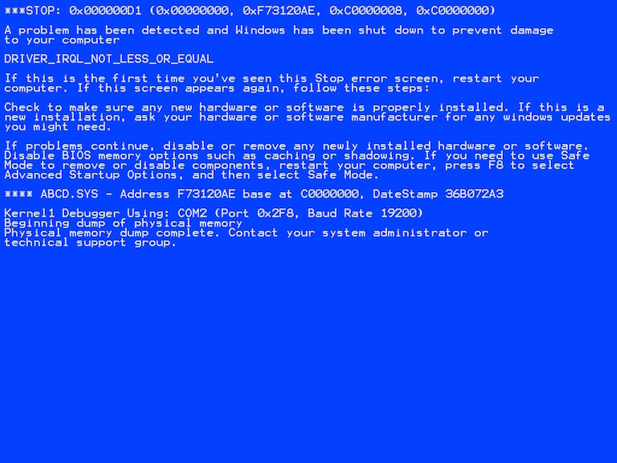
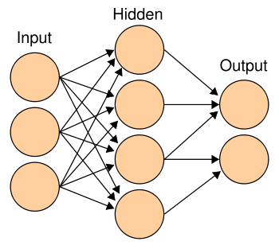

# DON'T PANIC

## Helpful resources

[deeplearning.net](http://deeplearning.net)

Deep learning (LeCun, Bengio, & Hinton (2015))

Deep Learning in neural networks: an overview [@schmidhuber2015deep]

Michael A. Neilsen's [Neural Networks & Deep Learning](http://neuralnetworksanddeeplearning.com/index.html)

# Perceptron

## Frank Rosenblatt & Mark 1 Perceptron


## Single layer perceptron

Take input \(x_{p\times 1}\) and calculate the weighed input \(w\cdot x + b\), where

- \(w_{p\times 1}\) is a vector of weights applied to the input, and
- \(b\) is a scalar bias term that offsets the weighted sum

Now, classify x according to

\[output = \begin{cases}
0 & \text{if } w\cdot x + b \leq 0 \\
1 & \text{if } w\cdot x + b > 0
\end{cases}\]

## Binary classification

```{r, echo=FALSE}
set.seed(42)
library(MASS)
library(ggplot2)
group <- sample(1:2, 100, replace=TRUE)
mu <- list(c(1, 1), c(-1, -1))
Sigma <- list(diag(2)/4, diag(2)/4)
x <- do.call(rbind, Map(mvrnorm, mu[group], Sigma[group], n=1))
n <- nrow(x)
df <- cbind.data.frame(x, group)
names(df) <- c("x", "y", "Group")
p <- ggplot(df, aes(x=x, y=y, color=factor(Group))) + geom_point() + guides(color=FALSE) + scale_y_continuous(lim=c(-2.5, 2.5)) + scale_x_continuous(lim=c(-2.5, 2.5))
p
```

## Binary classification

```{r, echo=FALSE, warning=FALSE}
a <- seq(-3, 3, by = 0.1)
df2 <- cbind.data.frame(a,-5*a)#, gl(2, length(a)))
names(df2) <- c("input", "line")#, "type")
p <- p + geom_line(data=df2, aes(x=input, y=line), lty=2, inherit.aes=FALSE)
p
```

## Binary classification

```{r, echo=FALSE, warning=FALSE}
df3 <- cbind.data.frame(a, -0.6 - 2*a)
names(df3) <- c("input", "line")
p <- p + geom_line(data=df3, aes(x=input, y=line), lty=2, inherit.aes=FALSE)
p
```

## Binary classification

```{r, echo=FALSE}
group <- c(1, 1, 2, 2)
x <- c(-1, 1, -1, 1)
y <- c(1, -1, -1, 1)
df <- cbind.data.frame(x, y, group)
names(df) <- c("x", "y", "Group")
ggplot(df, aes(x=x, y=y, color=factor(Group))) + geom_point(size=3) + scale_y_continuous(lim=c(-2.5, 2.5)) + scale_x_continuous(lim=c(-2.5, 2.5))+ guides(color=FALSE)
```

---



## End of the perceptron...

Training may result in wildly different classification boundaries.

Only applicable to linearly separable data.

@minsky1969perceptrons highlighted the inability to learn a simple XOR function.

Dealt a critical blow to the perceptron, research largely vanished.

1970s: \*crickets\*

## ... or is it?

**Two Ideas**: 

1. Use a more flexible function than the perceptron, and
2. Train multiple neurons within a layer or include additional layers.

This produces the **multilayer perceptron** (MLP).

Performs non-linear classification (i.e., does not require linear separability) and regression.

1980s: Resurgence in neural network research as a result.

## Sigmoid \(\;\sigma(z) = (1+e^{-z})^{-1}\)

```{r, echo=FALSE}
perceptron <- function(z) as.numeric(z > 0)
sigmoid <- function(z) 1/(1+exp(-z))
z <- seq(-7, 7, by=0.001)
df <- cbind.data.frame(rep(z, 2), c(sigmoid(z), perceptron(z)), gl(2, length(z)))
names(df) <- c("z", "activation", "type")
ggplot(df, aes(x=z, y=activation, color=type), alpha=0.6) + geom_line() + scale_color_discrete(name="Activation function", labels=c("Sigmoid", "Perceptron"))
```

# Artificial neural network

## Artificial neural network 



The data \(x\) are fed to the network through the **input layer**.  

Predictions are made at the **output layer**.  

So what happens in between? 

## Some notation

For layers \(l = 1, 2, \ldots, L\), define:

- \(w^l_{jk}\) is the **weight** between the \(k\)th neuron in layer \(l-1\) to the \(j\)th neuron in layer \(l\)
- \(b^{l}_j\) is the **bias** of the \(j\)th neuron in layer \(l\)
- \(a^l_j\) is the **activation** from the \(j\)th neuron in layer \(l\) defined by
\[
a^l_j = \sigma\left(\sum_k w^l_{jk}a^{l-1}_k + b^l_j\right) 
\]
where \(\sigma(\cdot)\) denotes the sigmoid **activation function**.

How to obtain optimal weights and bias terms?

## Loss function \(C\)

**Idea**: Define a loss function and minimize it with respect to all weights and biases using, say, gradient descent.

For a single training example \((x, y)\),

- Mean squared error: \(C(a^L) = \frac{1}{2}\sum_j (y_j - a^L_j)^2\)

- Cross-entropy: \[C(a^L) = -\frac{1}{2}\sum_j\left[y_j\ln a^L_j + (1-y_j)\ln(1-a^L_j)\right]\]

which are functions of the **predicted outputs** (i.e., activations of the final layer), which are, in turn, functions of the network's weights and biases.

## Backpropogation algorithm

Fast algorithm for calculating gradients by working backward from outputs to early layers [@rumelhart1988learning].

Define the error at neuron \(j\) in layer \(l\) by \(\delta^l_j = \frac{\partial C}{\partial z^l_j}\).

**Feedforward** \(\quad a^l_j = \sigma(z^l_j)\;\text{where}\;z^l_j = \sum_k w^l_{jk}a^{l-1}_k + b^l_j \)

**Error at output layer** \(\quad\delta^L_j = \frac{\partial C}{\partial z^L_j} = \frac{\partial C}{\partial a^L_j}\frac{\partial a^L_j}{\partial z^L_j} = \frac{\partial C}{\partial a^L_j}\sigma'(z^L_j)\)

**Error at earlier layers** \(\quad\delta^{l-1}_k = \left(\sum_jw^l_{jk}\delta^l_j\right)\sigma'(z^{l-1}_k)\)

**Gradients** \(\quad\frac{\partial C}{\partial w^l_{jk}} = a^{l-1}_k\delta^l_j\quad\text{and}\quad\frac{\partial C}{\partial b^l_j} = \delta^l_j\)

## Gradient descent

Iterating through this process to convergence, we continually update the weights and bias terms according to

\[
w^l_{jk} \leftarrow w^l_{jk} - \eta\frac{\partial C}{\partial w^l_{jk}}, \quad
b^l_j \leftarrow b^l_j - \eta\frac{\partial C}{\partial b^l_j} 
\]

where \(\eta\) is the **learning parameter** chosen by the user.

Unfortunately, successful convergence is proplematic due to the high-dimensional surface with a multitude of local minima.

**Idea**: Operate on random "mini-batches" of the training data instead; called
**stochastic gradient descent** (SGD).

## Hello world!

... Well, sorta. With these modifications, neural networks are competitive classifiers but still unable to learn a wide variety of patterns.

**Idea**: Pass inputs and weighted inputs through numerous hidden layers.

May better learn intricate patterns that just one or two layers are incapable of capturing. 

**Problem**: Too many layers, even just more than two, rapidly yields the **unstable gradient problem**.


## Unstable gradient problem

Gradient in early layers is the product of terms from all later layers.

These terms rarely "play nicely" with one another, causing the gradients to either **vanish** (approach 0) or **explode** (to \(\pm\infty\)).

Thus, these early layers learn *very* slowly, if at all. 

Since the NN's weights and biases are randomly initialized, they are likely far from optimal and, due to the unstable gradient problem, never even get close.

**Result**: Networks with many hidden layers (or those with many neurons) perform no better than those with only 1-2 hidden layers.

---

Early 1990s: Once hailed as the panacea of artificial intelligence, **neural network research is again largely abandoned** in favor of other machine learning methods, most notably the support vector machine (SVM). 

Late 1990s: \*mostly crickets\*

Early 2000s: \*still mostly crickets\*

2006: @hinton2006fast introduce a deep belief network (DBN) that circumvents the unstable gradient problem via unsupervised pre-training of each layer's weights and biases. @bengio2007greedy generalize this method to other techniques.

Incorporation of many hidden layers \(\rightarrow\) "deeper" network architectures are possible, hence...

# Deep learning

## Deep learning

Deep architecture allows the network to learn patterns from the *raw* data, rather than relying on "feature engineering" as is necessary in shallow architectures. 

### Further developments in DL

- Rectified linear units (ReLU) \(f(z) = \max(z, 0)\) learn quickly and, unlike the sigmoid, do not require unsupervised pre-training [@glorot2011deep].

- Dropout [@srivastava2014dropout] prevents overfitting by removing neurons that are least critical to prediction (similar in spirit to pruning in decision trees).

## Forms of deep learning

### Supervised learning

- **Convolutional neural nets** in computer vision, and
- **Recurrent neural nets** & **long short-term memory** in speech recognition and natural language processing
- Combined, these networks can learn image captioning. 

### Unsupervised learning (typically for pre-training)

- **Deep autoencoders**,
- **Deep belief networks**,
- **Restricted Boltzmann machines**

## Convolutional neural nets (CNNs)

Designed for data that are highly correlated in space. e.g., pixel intensities in a RGB image.

Introduces two alternating types of layers:

- **Convolutional layer** detects local features from previous layer 
- **Pooling layer** aggregates similar features together

Current state-of-the-art in object recognition and detection tasks in image processing.

## Convolutional neural nets (CNNs)

### 2012 ImageNet [@NIPS2012_4824]

**Task**: Perform object recognition on dataset of ~1,000,000 images with ~1,000 different classes.

*Halved* the error rate of its closest competitors.

### 2014 Galaxy Zoo [@dieleman2015rotation]

Key insight? "Exploiting invariances in the data using data augmentation."

"Using a feature learning approach does not excuse you from having to get to know the data;" [...] feature engineering "just happens at a higher level of abstraction." -- Dieleman in his [Kaggle interview](http://blog.kaggle.com/2014/04/18/winning-the-galaxy-challenge-with-convnets/)

## Recurrent neural nets (RNNs)

Designed for sequential inputs (such as those over time).

Introduces a state vector into hidden layer neurons to retain a history of past elements; essentially, a form of short-term memory.

A RNN is simply a very deep NN "unfolded in time," sharing weights and bias across layers.

Huge successes in speech recognition and natural language processing.

Still, learning long-term dependencies is hard...

## Long Short-Term Memory (LSTM) 

Originally developed by @hochreiter1997long, LSTM networks also introduce a memory cell that stores states for longer periods of time before clearing.

Able to "recall" past themes and events.

State-of-the-art in speech recognition systems, from raw audiowaves to word-for-word transcription.

## Unsupervised learning

Instrumental in reviving NN research through pre-training weights and biases. 

Still much more progress to be made, likely where the next "big hits" will come from.

Reinforcement learning is another encouraging area of research.

# Programming frameworks

## [Theano](http://deeplearning.net/software/theano/) (Python)

CPU/GPU symbolic expression compiler from Montreal Institute for Learning Algorithms (MILA) at University of Montreal.

Numerous Theano-based libraries including:  

- [Blocks](https://github.com/mila-udem/blocks) and [Fuel](https://github.com/mila-udem/fuel)
- [Keras](https://github.com/fchollet/keras)  
- [Lasagne](https://github.com/Lasagne/Lasagne)
- [Pylearn2](http://deeplearning.net/software/pylearn2/)


## [Torch7](http://torch.ch) (Lua + LuaJIT)

Lua is a lightweight, embeddable scripting language, designed for implementation in external applications.

Popular use in industry at Facebook, Google, & Twitter.

It is no coincidence that LeCun and Hinton head DL research labs at Facebook and Google, respectively.

## And the rest...

### [Caffe](http://caffe.berkeleyvision.org) (C++)
### [DeepLearnToolbox](https://github.com/rasmusbergpalm/DeepLearnToolbox) (Matlab)
### [Mocha](https://github.com/pluskid/Mocha.jl) (Julia)
### etc.

# Remember: DON'T PANIC

Thank you!

Questions or comments?

ngranth@ncsu.edu

## References
