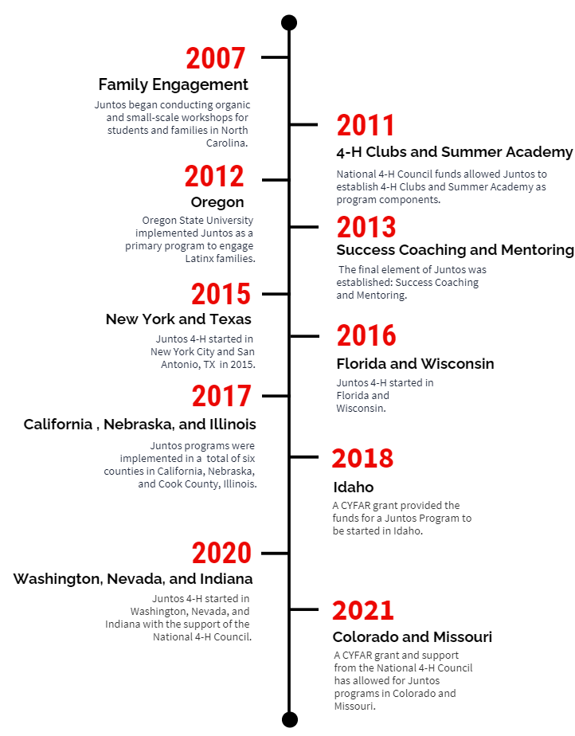

<head>
  <link rel="stylesheet" href="../css/styles.css">
</head>

<ul class = "menu">
    <li class = "menu"><a class = "menu" href="../index.html">Home</a></li>
    <li class="menu dropdown">
        <a href="Teaching.html" class="dropbtn">Teaching</a>
        

            <a href="PhilosophyCourses.html">Philosophy & Courses</a>
            <a href="Online.html">Online Education</a>
            <a href="ShinyApps.html">R Shiny Teaching Apps</a>
            <a href="MathStat.html">Teaching Mathematical Statistics Blog</a>
        

     </li>
    
    <li class="menu dropdown">
        <a href="OpenEd.html" class="dropbtn">Open Ed</a>
        

            <a href="SAS.html">Basics of SAS Course</a>
            <a href="Python.html">Basics of Python Course</a>
            <a href="R.html">Basics of R Course</a>
            <a href="TeachingWithR.html">Teaching with R</a>
            <a href="R4Reproducibility.html">R4Reproducibility</a>
            <a href="DataMattersCourses.html">Basics of R for Data Science and Statistics</a>
            <a href="DataMattersCourses.html">Improving R Programs</a>
            <a href="DataMattersCourses.html">R for Automating Workflow and Sharing Work</a>
        

     </li>
    <li class = "menu dropdown">
      <a class = "dropbtn" href="OtherActivities.html">Other Activities</a>
        

            <a href="OutreachDiversity.html">Outreach & Diversity</a>
            <a href="UndergradResearch.html">Undergraduate Research</a>
            <a href="StatisticalLearningGroup.html">Statistical Learning Group</a>
            <a href="SportsStats">Sports Statistics</a>
            <a href="ArticlesWorkshops">Articles, Workshops, Quantitative Literacy, & More</a>
        

    </li>
    <li class = "menu" style="float:right"><a class = "menu" href="CV.html">CV</a></li>
</ul>

 

## Stat’n’Chat

The Stat’n’Chat group is a collection of some local introductory
statistics instructors from different high schools/colleges/universities
that have gotten together to network and share ideas. We’ve had people
from NC State, Wake Tech Community College, Meredith College, Cary
Academy, and a few others.

We usually meet monthly on a Friday for dinner and discussion. If you
are interested in joining, please e-mail me and I’ll add you to our
mailing list!

## Cary Academy

I met [Craig Lazarksi](https://www.linkedin.com/in/craig-lazarski/)
(winner of the Cary Chamber of Commerce Honor a Teacher Award in 2022!
see picture below for proof) and Kristi Ramey as their instructor in our
online master’s program. They are both local and teach in the math
department at [Cary Academy](https://www.caryacademy.org/).

As fellow educators we struck up a friendship. They approached me about
a collaboration with their high school ‘statculus’ course and I was
excited to join in. This course had a lot of flexibility but blended
calculus ideas with statistics (and a bit of R).

In fall 2021 I taught six guest lectures around the ideas of using a
model to predict, including quantifying quality of predictions using
loss functions and how calculus is important to those ideas. The methods
we focused on were multiple linear regression and k-nearest neighbors.
In the end we had the students break into teams and compete in a kaggle
competition (inactive one but still a great experience).

In spring 2023 we renewed the collaboration with a slightly different
focus. This time the students were participating in an actuarial data
challenge. They had to find a problem with data and propose a change or
recommendation based on an analysis. The lectures I taught focused on
inference when using linear and logistic regression along with the R
implementation!

You can find [information about the materials
here](https://github.com/jbpost2/caryAcademy).

## NC Education Datathon

The North Carolina Department of Education put on an education datathon
to analyze the digital divide in North Carolina. I particpated on a team
with [Victoria Seng](https://www.linkedin.com/in/victoria-seng/), Craig
Lazarski, and Kristi Ramey. Our team placed first (the other team
members did 95% of the work, I was mostly just advising!) and we won the
\$2000 dollar prize!

You can see our [github repo
here](https://github.com/jbpost2/Edu-tastic) and you can see our final
presentation below:

<iframe width="560" height="315" src="https://www.youtube.com/embed/qPrM3FqpAf8" title="YouTube video player" frameborder="0" allow="accelerometer; autoplay; clipboard-write; encrypted-media; gyroscope; picture-in-picture" allowfullscreen>
</iframe>

The application itself is available to play around with here:
<https://shiny.stat.ncsu.edu/jbpost2/DigitalDivide>

## Juntos

[Juntos](https://juntos.dasa.ncsu.edu/#) is a program that NC State
started in 2007 to ‘provide high school Latino students and their
families with the knowledge, skills, and resources to ensure high school
graduate and increase college access and attendance rates.’

I got started with the group in 2017 when one of our undergraduate
students did a project with them. After meeting with them, we decided to
have an undergraduate internship/research type position there for a few
semesters. During this time I helped them to completely revamp their
data collection and reporting processes (we went from individual excel
files and manually tabulation to a database with an online form their
mentors could use with automated reporting). Our student [Didier
Turcios](https://www.linkedin.com/in/didierturcios/) held the internship
position there for a year and now serves as their program evaluator!
(He’s also a current statistician at RTI International and in our online
master’s of statistics program.)

This is a really fantastic program and I’m happy to have been involved!

## Cary PD

In 2017 I advised [Grant
Swigart](https://www.linkedin.com/in/grantswigart/) on a really
interesting project with the Cary Police Department. The goal was:

> To utilize a neutral, third party subject matter expert (NCSU
> Statistics) to proactively analyze Cary PD’s traffic stops on both an
> aggregate and individual level and determine if we have any
> statistically significant deviations from a normal range as it relates
> to officer traffic stops, searches, and arrests of women, persons of
> color and Hispanic heritage. Our benchmark/point of comparison will be
> the gender, race, and heritage of persons involved in traffic
> collisions as captured by Cary PD’s traffic collision reports. These
> data are much more representative of who makes up the motoring public
> than census data, which is designed purely to captures residency
> information. Statistical deviations from the norm in and of themselves
> will not to be considered indicative of wrongdoing, but rather will
> serve as an impetus to further examine the circumstances involved with
> the officer or group of officers outside the normal range.

Grant did a great job working through the data and literature (he
ultimately went on to get a master’s degree in statistics from NC
State). Ultimately we stopped hearing back from the Cary PD after our
initial findings of some differences in traffic stop distributions.

## GLBT advocate

> The GLBT Advocate Program is intended to be a continuing education and
> engagement program for NC State faculty and staff. The Program is
> designed to provide faculty and staff with ongoing opportunities for
> learning and for showing their support as Allies and Advocates of the
> GLBT community. Faculty and staff who would like to participate in the
> Program agree to complete one educational workshop and attend one GLBT
> event on campus each year.

I’ve enjoyed being a [GLBT
advocate](https://diversity.ncsu.edu/glbt/glbt-advocate-list/). The
program is really educational and has helped me to understand barriers
and issues faced by those in the GLBT community.

## Pack Promise Mentor

[Pack Promise](https://news.ncsu.edu/tag/pack-promise/) is a great
program for families with limited financial resources. Students from
these families tend to be first-generation college students. As a first
generation college student myself, I was really glad to see NC State has
a program to help guide students through the unknowns of a large
university. I served as a Pack Promise faculty mentor to a stats major
(she now has a master’s degree in statistics!). We met each semester to
talk about clubs to get involved with, opportunities within the
department and campus, and generally answered any questions about how
things work at the university. All things I wish I had when I was an
undergraduate student! (I never even considered graduate school until my
senior year of college!)
