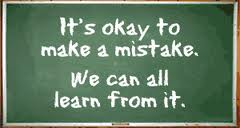
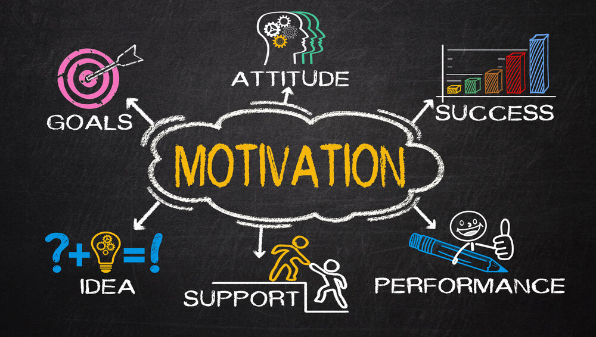
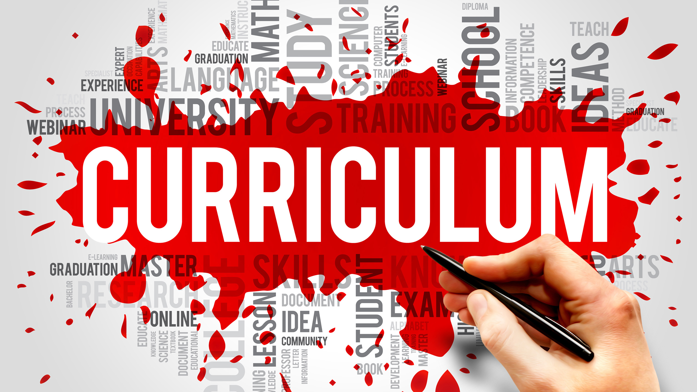

<head>
  <link rel="stylesheet" href="../css/styles.css">
</head>

<ul class = "menu">
    <li class = "menu"><a class = "menu" href="../index.html">Home</a></li>
    <li class="menu dropdown">
        <a href="Teaching.html" class="dropbtn">Teaching</a>
        

            <a href="PhilosophyCourses.html">Philosophy & Courses</a>
            <a href="Online.html">Online Education</a>
            <a href="ShinyApps.html">R Shiny Teaching Apps</a>
            <a href="MathStat.html">Teaching Mathematical Statistics Blog</a>
        

     </li>
    
    <li class="menu dropdown">
        <a href="OpenEd.html" class="dropbtn">Open Ed</a>
        

            <a href="SAS.html">Basics of SAS Course</a>
            <a href="Python.html">Basics of Python Course</a>
            <a href="R.html">Basics of R Course</a>
            <a href="OtherRCourses.html#TeachingWithR">Teaching with R</a>
            <a href="OtherRCourses.html#DataMatters">Basics of R for Data Science and Statistics</a>
            <a href="OtherRCourses.html#DataMatters">Improving R Programs</a>
            <a href="OtherRCourses.html#DataMatters">R for Automating Workflow and Sharing Work</a>
        

     </li>
    <li class = "menu"><a class = "menu" href="Articles.html">Articles</a></li>
    <li class = "menu"><a class = "menu" href="Outreach.html">Outreach</a></li>
    <li class = "menu"><a class = "menu" href="QL.html">Numeracy</a></li>
    <li class = "menu"><a class = "menu" href="Misc.html">Misc.</a></li>
    <li class = "menu" style="float:right"><a class = "menu" href="CV.html">CV</a></li>
</ul>

 

## Philosophy

As a teacher, my goals are to **make students feel welcome and
supported** in the classroom, **motivate them to learn** the material,
and **engage them in a discussion** of that material that leads to a
deeper understanding of the concepts involved. By using active learning
and involving them in a discussion of the material, students are forced
to truly grapple with the ideas. This can **foster the critical thinking
and problem solving skills** they need to succeed in and out of the
classroom.

To me the most important aspect of teaching is to create a comfortable,
inclusive, and interactive learning environment for our students. **A
welcoming classroom makes students feel confident enough to voice their
questions and opinions and begin a dialogue with us.** To create a
positive environment it is important to treat students with respect.
This starts with a positive tone on the syllabus, clear expectations for
success, and language about using preferred names and pronouns. In class
I am careful to use examples that are inclusive and highlight
contributions from underrepresented groups.

In a face-to-face class I question the class about how what we are
learning fits into the bigger picture narrative of the course. **This
encourages discussions between the instructor and the students and helps
to break down the usual passive learning, lecturer/listener paradigm and
instead promotes active and engaged students.** In online courses I
emulate this practice by recording shorter videos and including
questions throughout. This helps the students to engage with the
material and reflect on their learning process. I use discussion board
posts to allow for student questions and participation in the larger
conversation. In all of my courses I am unwaveringly positive when a
student participates, whether they are right or wrong in their answer.
The contribution is useful even when it is wrong as it allows us to
discuss how we may have gone off track.

I’m very careful to show the passion and enthusiasm for their learning
on a daily basis. I make sure that they know I am there to support them
and help them achieve at the highest level. **These efforts make
students feel comfortable and that we have a mutual vested interest in
the course.**

It is vitally important to motivate our students to be successful and
set clear expectations for success. For me, this starts by being
prepared at the beginning of the semester with a narrative for the
entire course and by giving students clearly defined expectations of how
to be successful. **Motivating students helps them to see the big
picture concepts and make the important connections with other ideas in
the course that lead to a deeper and more full understanding of the
material.**

I start each class with discussion of where we are in our narrative,
what we are doing, and why we are doing it. This clearly places the
material in their minds. Each topic in the course is introduced with a
motivating example that allows them to see why it is useful and what
they’ll be able to do once they’ve learned it. I’m careful to set clear
goals for the level of understanding the students should have and how
their learning will be assessed. The students are more motivated to
achieve when they can easily see what they need to do to prosper in the
course.

Purposeful assessments are another way in which we can engage students
in a discussion of the material. Along with the usual low stakes
assessments, I love to give my students class projects, concept map
assignments, and capstone projects. I usually require group work in
these assignments to force the students to explain and defend their
thinking to their peers. **These types of assessments require purposeful
communication, problem solving, and high-level critical thinking that
truly leads to a deeper, longer lasting, understanding.**

Lastly, teaching requires that we do our best to never become passive.
**We should always be refining our craft and learning new pedagogy.**
Each class will be different and thus, we must adapt for the current
batch of students. We should constantly ask for and incorporate student
feedback. The students of ten years from now will surely be as different
as students from ten years ago. We must continue to go to workshops,
participate in faculty exchanges, and attend conferences.

**I believe that if we can accomplish these goals, the sky’s the limit
for the learning that will occur in our classrooms!** When students are
comfortable in their learning environment, motivated to learn the
material, and are constantly engaging with the material, we can get them
to develop their problem solving and high-level critical thinking skills
required to be successful.

## Courses Taught

I’ve taught a lot of courses while at NC State, including many courses
for our online Master’s program. The courses I’ve taught are listed
below. I really enjoy creating new courses and creating a coherent
curriculum. The courses I’ve designed or revamped are in bold.

-   **ST 307 - Introduction to Statistical Programming - SAS**
-   **ST 308 - Introduction to Statistical Programming - R**
-   ST 311 - Introduction to Statistics
-   ST 370 - Probability and Statistics for Engineers
-   ST 372 - Introduction to Statistical Inference and Regression
-   ST 421 - Introduction to Mathematical Statistics I
-   ST 422 - Introduction to Mathematical Statistics II
-   **ST 501 - Fundamentals of Inference I**
-   **ST 502 - Fundamentals of Inference II**
-   ST 511 - Statistical Methods For Researchers I
-   ST 512 - Statistical Methods For Researchers II
-   **ST 513 - Statistics for Management and Social Sciences I**
-   **ST 514 - Statistics for Management and Social Sciences I** (I’ve
    not been the instructor of record for this course.)
-   ST 521 - Statistical Theory I
-   **ST 554 - Big Data Analysis**
-   ST 555 - Statistical Programming I
-   **ST 558 - Introduction to Data Science**

If you are currently enrolled in one of these courses, the material for
the classes is available on [wolfware](https://www.wolfware.ncsu.edu).

I’ve also taught Calculus II and Differential Equations at the
University of Mount Union.

## Professional Development

I’ve taught professional development workshops many times over the
years. These mostly are concerned with statistical programming. You can
find information about these courses on my [open education
page](OpenEd.html).
