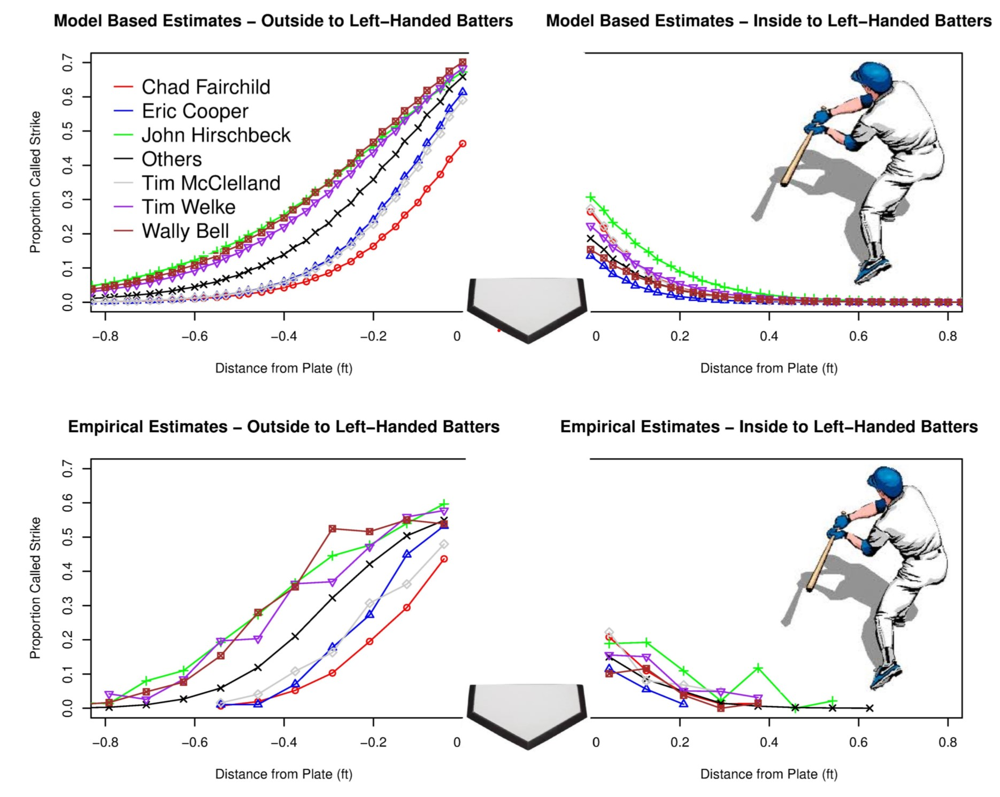
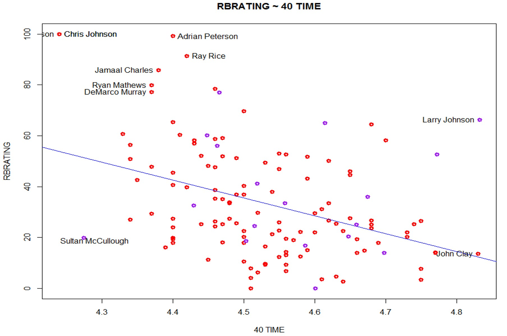
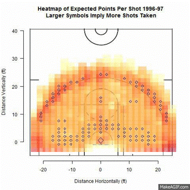
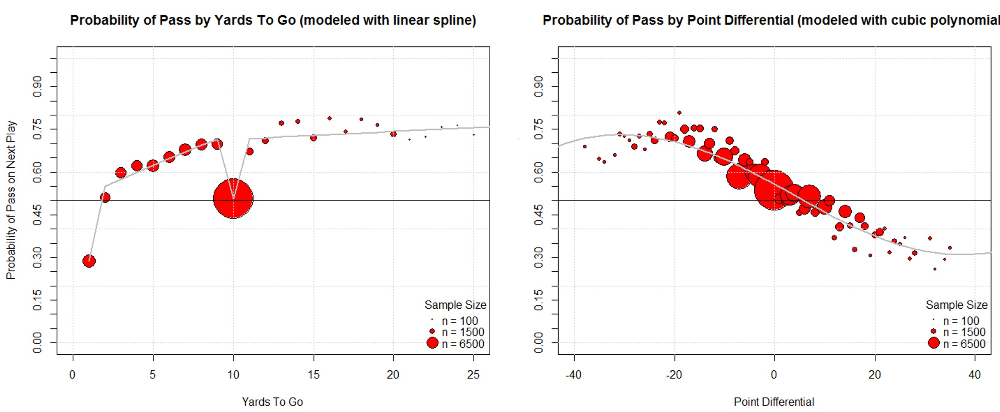
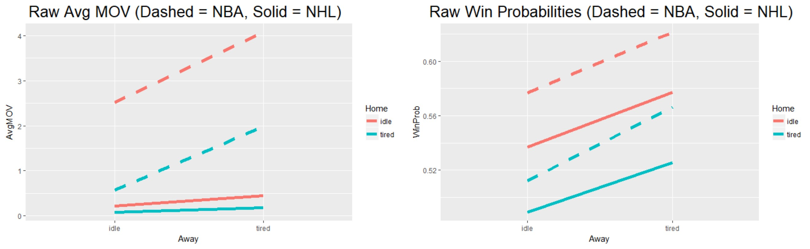

<head>
  <link rel="stylesheet" href="../css/styles.css">
</head>

<ul class = "menu">
    <li class = "menu"><a class = "menu" href="../index.html">Home</a></li>
    <li class="menu dropdown">
        <a href="Teaching.html" class="dropbtn">Teaching</a>
        

            <a href="PhilosophyCourses.html">Philosophy & Courses</a>
            <a href="Online.html">Online Education</a>
            <a href="ShinyApps.html">R Shiny Teaching Apps</a>
            <a href="MathStat.html">Teaching Mathematical Statistics Blog</a>
        

     </li>
    
    <li class="menu dropdown">
        <a href="OpenEd.html" class="dropbtn">Open Ed</a>
        

            <a href="SAS.html">Basics of SAS Course</a>
            <a href="R.html">Basics of R Course</a>
            <a href="Python.html">Big Data (with python)</a>
            <a href="558R.html">Data Science for Statisticians</a>
            <a href="TeachingWithR.html">Teaching with R</a>
            <a href="R4Reproducibility.html">R4Reproducibility</a>
            <a href="DataMattersCourses.html">Basics of R for Data Science and Statistics</a>
            <a href="DataMattersCourses.html">Improving R Programs</a>
            <a href="DataMattersCourses.html">R for Automating Workflow and Sharing Work</a>
        

     </li>
    <li class = "menu dropdown">
      <a class = "dropbtn" href="OtherActivities.html">Other Activities</a>
        

            <a href="OutreachDiversity.html">Outreach & Diversity</a>
            <a href="UndergradResearch.html">Undergraduate Research</a>
            <a href="StatisticalLearningGroup.html">Statistical Learning Group</a>
            <a href="SportsStats">Sports Statistics</a>
            <a href="ArticlesWorkshops">Articles, Workshops, Quantitative Literacy, & More</a>
        

    </li>
    <li class = "menu" style="float:right"><a class = "menu" href="CV.html">CV</a></li>
</ul>

 

## Sports Statistics

From 2014 to 2018 I had the pleasure of being a co-faculty adviser (with
<a href = "https://www4.stat.ncsu.edu/~osborne/" target = "_blank">Jason
Osborne</a>) of the
<a href = "https://linktr.ee/ncsusac" target = "_blank">Sports Analytics
Club (SAC)</a> here at NC State.

Jason and I connected over our shared interest in the Pittsburgh
Steelers. We started out doing a presentation about umpire
effectiveness. This was before PitchFx data was widely available and way
before they put the strike zones on the telecasts! We presented a poster
at the
<a href = "http://www.nessis.org/nessis13.html" target = "_blank">2013
NESSIS conference</a> titled *Modelling Umpire Misclassification of
Balls and Strikes using PitchFX Data*. The
<a href = "../files/pitching_poster.pdf" target = "_blank">full poster
is available here</a>.

We helped form a sports stats club (later renamed Sports Analytics Club)
headed by a truly fantastic group of students (they really drove the
success of the club). Some have gone on to work for professional teams.
Below is a list of the most influential students from my time with the
group (the first five were the founding members) and sports related
roles that I can remember:

- <a href = "https://www.linkedin.com/in/nicholas-kapur-21529590/" target = "_blank">Nick
  Kapur</a> - Has worked for the Yankees and Dodgers and currently works
  at a sports consulting firm
- <a href = "https://www.linkedin.com/in/james-gilman-24376684/" target = "_blank">James
  Gilman</a> - Director of Football Analytics with the Eagles
- <a href = "https://www.linkedin.com/in/michael-t-dickey/" target = "_blank">Michael
  Dickey</a>
- <a href = "https://www.linkedin.com/in/caitlin-kapur-53440257/" target = "_blank">Caitlyn
  (Phelps) Kapur</a> - Worked with Richard Childress Racing
- <a href = "https://www.linkedin.com/in/marschall-furman/" target = "_blank">Marschall
  Furman</a>
- <a href = "https://www.linkedin.com/in/wjburton/" target = "_blank">Will
  Burton</a>
- <a href = "https://www.linkedin.com/in/jason-thompson-190070137/" target = "_blank">Jason
  Thompson</a>
- <a href = "https://www.linkedin.com/in/nicholas-kapur-21529590/" target = "_blank">Rebekah
  Colonnese</a>,
  <a href = "https://www.linkedin.com/in/megan-tabor-6709a315a/" target = "_blank">Megan
  Tabor</a>,
  <a href = "https://www.linkedin.com/in/cole-adams-54225114b/" target = "_blank">Cole
  Adams</a> - Worked extensively with NC State Baseball
- <a href = "https://www.linkedin.com/in/sam-gasell/" target = "_blank">
  Sam Gasell</a> - Data Scientist with the Reds
- <a href = "https://www.linkedin.com/in/bradypbaker/" target = "_blank">Bradey
  Baker</a> - Senior Data Analyst with the Pacers

I gave an invited presentation about the success of the club at
increasing student involvement and promoting undergraduate research at
JSM in 2015. You can find slides for the talk:
<a href ="../files/Post_Justin_JSM2015_Sports_Stats_Club_Formation.pdf" target = "_blank">*Increasing
Undergraduate Student Knowledge and Interest Using a Sports Stats Club*
here</a>.

Below are a few of the projects I worked on with club members!

### Using NFL Draft Metrics to Predict Player Success - James Gilman & Nick Kapur

We did a
<a href = "../files/NFL_draft_player_success.pptx" target = "_blank">speed
session</a> on this topic at the 2014 Joint Statistical Meetings.

> The NFL draft has become a 3-day spectacle that can change the
> fortunes of a team. There are many draft gurus that attempt to rank
> players and project their futures. In an effort to make draft grades
> more objective and data driven, we attempt to use NFL scouting combine
> data and college affiliation to predict NFL impact. Many players do
> not complete every drill during the combine, resulting in a lot of
> missing data. Therefore, we use multiple imputation methods and linear
> regression models in order to predict player success. We look at which
> drills relate to having the most success at the different positions,
> which teams draft well based off our model, and which collegiate
> conferences produce the most NFL ready players.

### Effect of Shot Location Trends on Offensive Efficiency in the NBA - Michael Dickey

If you’ve watched the NBA over the last 20 years you’ve seen a big shift
in how the game is played. We did a
<a href = "../files/Shot_Location_NBA.pptx" target = "_blank">speed
session</a> on this topic at the 2014 Joint Statistical Meetings.

> After observing a substantial increase in three point shot attempts in
> recent NBA seasons, one may wonder what effect this has on the amount
> of other shots taken and how efficient offenses have become as a
> result. Using NBA shooting data from the 2000-2013 seasons we
> investigate trends in distance of shots taken from 2 and 3-point
> ranges. Specifically, we use multiple logistic regression to determine
> the relationships between number of shot attempts at differing
> distances and points per possession from across seasons.  We attempt
> to identify types of shots resulting in the most points-per-possession
> and which NBA teams are adapting this strategy. Points-per-game of
> teams found to follow this trend are compared with teams that have not
> through the use of pairwise comparison tests. The results will find
> the most efficient shots in basketball that coaches could use to
> design their offenses.

### NFL Play Predictions - Will Burton and Michael Dickey

We did a
<a href = "../files/NFL_play_prediction.pptx" target = "_blank">speed
session</a> on this topic at the 2015 Joint Statistical Meetings. It
actually got a good bit of attention and Will got to go to the
superbowl!

> A valuable skill for NFL coaches is to be able to anticipate whether
> the opposing team will call a pass or run play. If the offensive play
> type can be predicted, the defensive team can call for example, a
> blitz or coverage play to gain an advantage. Based on various factors
> we develop a classification model, trained using play by play data for
> the 2012 and 2013 NFL seasons, to predict future play types. The
> factors used for initial consideration are: average yards per pass
> play, average yards per run play, previous 3 plays, distance to first
> down, distance to goal line, down, point differential,quarter, and
> time remaining. Factors used in the final model are determined using
> variable selection techniques. We compare the accuracy of multiple
> classification methods including logistic regression and decision
> trees to determine the optimal model. Once a final model is
> determined, an interactive visualization is created using the R Shiny
> package. This visualization is an intuitive and easily interpretable
> way to make real time decisions given the current game conditions.

### Scheduling Effects in the NBA and NHL - Jason A. Osborne

Jason presented
<a href ="../files/scheduling_effects.pdf" target = "_blank">this
poster</a> at the 2017 New England Symposium on Statistics in Sports.
The main idea was to consider scheduling effects for these two sports
and how that could be used in betting (unfortunately we aren’t rich
now).

> Teams in the NBA are giving increasing consideration to the issue of
> fatigue, recognizing that without rest, performance might be
> compromised. Using generalized linear mixed models we estimate effects
> of schedule conditions, whether home/road teams were idle, home or
> away the day prior to a regular season contest in professional hockey
> and basketball. We attempt to control for team strengths with
> factorial effects for home and visiting teams. On the scale of win
> probabilities, we find the magnitude of the estimated effects of one
> day of rest for the home team and the away team to be highly
> significant, additive and comparable across the two sports. The
> relative change in estimated win probability from the least to the
> most favorable schedule conditions is as large as 17%(NHL) or
> 18%(NBA).

> We also find evidence that bettors are taking schedules into
> consideration. Published point spreads and over/under (o/u) lines in
> the NBA differ significantly across schedule conditions, achieving an
> ordering that is consistent with the conventional wisdom that having
> to play the day before a contest and then travel has a negative effect
> on performance. Interestingly, the observed over/under lines do not
> differ significantly across scheduling conditions, nor reflect this
> conventional wisdom. Lastly, inclusion of an overtime effect can
> “debias” factorial team effect estimates and improve predictions made
> prospectively (without knowledge of whether wagered-upon games went
> into overtime), identifying a possible market inefficiency.

### Hockey Scoring Rates - Sam Gassell

This
<a href = "https://github.com/SamGasell/NHL-Shift-Project" target = "_blank">project
gathers the average shift and scoring data during the 2019-2020 NHL
regular season, and analyzes their relationship with Poisson
regression</a>. We didn’t end up presenting this or publishing this
anywhere.

### NFL Momentum - Trevor Hughes

We worked on a project to quantify momentum in the NFL. We didn’t end up
presenting this or publishing this anywhere.
